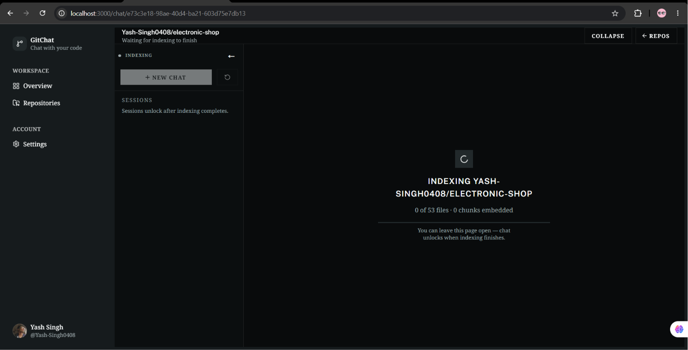

<div align="center">

# 💬 GitChat

### Chat with any GitHub repository using AI

Ask questions about code, understand architecture, trace logic — all in natural language with cited file references.

<br/>

[](https://spring.io/projects/spring-boot)
[](https://nextjs.org)
[](https://openjdk.org)
[](https://react.dev)
[](https://github.com/pgvector/pgvector)
[](https://ai.google.dev)

</div>

---

## 📸 Screenshots

<!-- SCREENSHOT: Landing / Hero Page -->
> **Hero / Landing Page**
>
> 

---

<!-- SCREENSHOT: Dashboard — Repository list with index status badges -->
> **Dashboard — Repository List**
>
> 

---

<!-- SCREENSHOT: Repository Detail — 3D file tree + index progress -->
> **Repository View — 2D/3D File Tree**
>
> 

---

<!-- SCREENSHOT: Chat interface with streamed response and citations -->
> **Chat Interface - Streaming Response with Code Citations**

> 

<!-- SCREENSHOT: Chat interface with streaming response and citations --> 
>**Chat Interface - Indexing/Chunking**


---

## ✨ Features

- 🔐 **GitHub OAuth2 Login** — Sign in with your GitHub account; access tokens are AES-encrypted at rest
- 📦 **Repository Sync** — Automatically syncs all your public and private repositories from GitHub
- 🧠 **Smart Indexing** — Crawls your repo's source files, chunks them, embeds them with Gemini, and stores them in a pgvector database
- 📊 **Live Index Progress** — Real-time progress bar showing files processed and chunks created
- 🌳 **3D/2D Repository Tree** — Interactive Three.js-powered 3D visualization of your repository's file structure
- 💬 **RAG-Powered Chat** — Ask any question about your codebase; answers are grounded in relevant code chunks retrieved from the vector store
- ⚡ **Streaming Responses** — Answers stream token-by-token over SSE for an instant, fluid experience
- 📎 **Code Citations** — Every answer includes clickable file path citations showing exactly which code was used
- 🌙 **Dark Mode** — Full dark/light theme support

---

## 🏗️ Architecture

```
┌─────────────────────────────────────────────────────┐
│                   Browser (Client)                  │
│         Next.js 16 · React 19 · TailwindCSS v4      │
│          TanStack Query · Three.js · Streamdown     │
└────────────────────┬────────────────────────────────┘
                     │  REST API + SSE streaming
┌────────────────────▼────────────────────────────────┐
│                Spring Boot 4.1 Backend              │
│         Java 21 · Spring AI 2.0 · Spring Security   │
│                                                     │
│  ┌───────────┐  ┌──────────────┐  ┌──────────────┐  │
│  │  GitHub   │  │  Indexing    │  │  RAG Chat    │  │
│  │  OAuth2   │  │  Pipeline    │  │  Pipeline    │  │
│  └───────────┘  └──────┬───────┘  └──────┬───────┘  │
└────────────────────────│─────────────────│──────────┘
                         │                 │
         ┌───────────────▼─────────────────▼───────────┐
         │     PostgreSQL 16 + pgvector extension      │
         │   HNSW Index · Cosine Distance · 1536-dim   │
         └─────────────────────────────────────────────┘
                          │
         ┌────────────────▼──────────────┐
         │       Google Gemini API       │
         │  gemini-3.6-flash (chat)      │
         │  gemini-embedding-001 (embed) │
         └───────────────────────────────┘
```

---

## 🔄 How It Works

### 1. Indexing a Repository
```
GitHub Repo Tree
       │
       ▼
Filter source files (by extension + size)
       │
       ▼
Fetch file content via GitHub API
(rate-limited: 50ms delay between calls)
       │
       ▼
Chunk into overlapping segments
(800 tokens · 100 token overlap)
       │
       ▼
Embed with Gemini Embedding API (1536-dim)
       │
       ▼
Store in pgvector (batches of 32)
```

### 2. Answering a Question (RAG)
```
User Question
      │
      ▼
Vector similarity search (top-K chunks, filtered by repoId)
      │
      ▼
Build system + user prompt with retrieved code context
      │
      ▼
Stream response from Gemini (gemini-3.6-flash)
      │
      ▼
SSE events → Browser  [token · user_message · assistant_message · done]
      │
      ▼
Save assistant message + citations to PostgreSQL
```

---

## 🚀 Getting Started

### Prerequisites

| Requirement | Version |
|---|---|
| Java | 21+ |
| Node.js | 18+ |
| Docker & Docker Compose | Latest |
| Google AI API Key | [Get one here](https://ai.google.dev) |
| GitHub OAuth App | [Create one here](https://github.com/settings/developers) |

---

### 1. Clone the Repository

```bash
git clone https://github.com/Yash-Singh0408/GitChat.git
cd GitChat
```

### 2. Start the Database

```bash
docker compose up -d
```

This starts PostgreSQL 16 with the `pgvector` extension on port `5433`.

### 3. Configure the Backend

Create a `.env` file or set environment variables before starting the backend:

```env
# Required
GOOGLE_API_KEY=your_google_gemini_api_key

# GitHub OAuth App credentials
GITHUB_CLIENT_ID=your_github_oauth_client_id
GITHUB_CLIENT_SECRET=your_github_oauth_client_secret

# Security (change these!)
TOKEN_ENCRYPTOR_PASSWORD=your_strong_random_password_here
TOKEN_ENCRYPTOR_SALT=your_hex_salt_here

# Optional — defaults shown
DB_URL=jdbc:postgresql://localhost:5433/databse_name
DB_USERNAME=postgres
DB_PASSWORD=postgres
FRONTEND_URL=http://localhost:3000
CORS_ALLOWED_ORIGINS=http://localhost:3000
```

> **Setting up a GitHub OAuth App:**
> 1. Go to [GitHub Developer Settings](https://github.com/settings/developers) → **New OAuth App**
> 2. **Homepage URL**: `http://localhost:3000`
> 3. **Authorization callback URL**: `http://localhost:8080/login/oauth2/code/github`

### 4. Run the Backend

```bash
cd backend
./mvnw spring-boot:run
```

The API starts on `http://localhost:8080`.

### 5. Run the Frontend

```bash
cd client
npm install
npm run dev
```

The app starts on `http://localhost:3000`.

---

## 📁 Project Structure

```
GitChat/
├── backend/                        # Spring Boot API (Java 21)
│   └── src/main/java/com/example/backend/
│       ├── config/                 # Security, CORS, Crypto, AppConfig
│       ├── controller/             # Auth, Chat, Repo REST controllers
│       ├── dto/                    # Request & Response records
│       ├── entity/                 # JPA entities
│       ├── repository/             # Spring Data JPA repositories
│       ├── security/               # OAuth2 user service, @CurrentUser
│       └── services/
│           ├── ai/                 # RAG pipeline (retrieval, prompt, streaming, citations)
│           ├── github/             # GitHub API client + rate limiter
│           ├── indexing/           # Async indexing (chunker, file filter)
│           └── utils/              # Tree builder
│
├── client/                         # Next.js 16 frontend (TypeScript)
│   ├── app/                        # App Router pages
│   │   ├── page.tsx                # Landing page
│   │   ├── login/                  # Login page
│   │   ├── auth/callback/          # OAuth callback
│   │   ├── dashboard/              # Repository dashboard
│   │   └── chat/[repoId]/          # Chat interface
│   ├── components/
│   │   ├── chat/                   # Chat UI (messages, sidebar, composer, citations)
│   │   ├── dashboard/              # Repo cards, tree view, settings
│   │   ├── landing/                # Hero, header, footer sections
│   │   └── ui/                     # Shared UI primitives (shadcn)
│   ├── hooks/                      # use-auth, use-chat, use-repos, use-mobile
│   └── lib/                        # api.ts, stream-chat.ts, query-keys.ts
│
└── docker/
    └── postgres/                   # pgvector extension init SQL
```

---

## 🛠️ Tech Stack

### Backend
| | |
|---|---|
| **Framework** | Spring Boot 4.1.1 |
| **Language** | Java 21 |
| **AI** | Spring AI 2.0.1 (`spring-ai-starter-model-google-genai`) |
| **Vector Store** | Spring AI PGVector (`spring-ai-starter-vector-store-pgvector`) |
| **Security** | Spring Security · GitHub OAuth2 |
| **Database** | PostgreSQL 16 + pgvector · Spring Data JPA |
| **Utilities** | Lombok · Jakarta Validation · Spring Actuator |

### Frontend
| | |
|---|---|
| **Framework** | Next.js 16.3 (App Router) |
| **Language** | TypeScript 5 |
| **Styling** | TailwindCSS v4 |
| **UI Components** | Shadcn/UI · Base UI · Lucide React |
| **State Management** | TanStack Query v5 |
| **3D Visualization** | Three.js |
| **Markdown** | Streamdown (streaming-aware renderer) |
| **Charts** | Recharts |

---

## 🔌 API Reference

| Method | Endpoint | Description |
|---|---|---|
| `GET` | `/api/auth/me` | Get current authenticated user |
| `POST` | `/api/auth/logout` | Log out |
| `GET` | `/api/repos?refresh=true` | List & sync repositories from GitHub |
| `GET` | `/api/repos/:id` | Get a single repository |
| `POST` | `/api/repos/:id/index` | Start indexing a repository |
| `GET` | `/api/repos/:id/status` | Get indexing status & progress |
| `GET` | `/api/repos/:id/tree` | Get repository file tree |
| `POST` | `/api/chat/sessions` | Create a new chat session |
| `GET` | `/api/chat/sessions?repositoryId=` | List chat sessions for a repo |
| `GET` | `/api/chat/sessions/:id` | Get all messages in a session |
| `POST` | `/api/chat/sessions/:id/messages` | Send a message (SSE stream) |

---

## ⚙️ Configuration Reference

All backend settings can be overridden via environment variables:

| Property | Env Variable | Default |
|---|---|---|
| `spring.datasource.url` | `DB_URL` | `jdbc:postgresql://localhost:5433/devpilot` |
| `spring.ai.google.genai.api-key` | `GOOGLE_API_KEY` | *(required)* |
| `spring.security.oauth2...client-id` | `GITHUB_CLIENT_ID` | *(required)* |
| `spring.security.oauth2...client-secret` | `GITHUB_CLIENT_SECRET` | *(required)* |
| `app.frontend-url` | `FRONTEND_URL` | `http://localhost:3000` |
| `app.token-encryptor-password` | `TOKEN_ENCRYPTOR_PASSWORD` | *(change me!)* |
| `app.indexing.max-file-bytes` | — | `102400` (100 KB) |
| `app.indexing.chunk-size` | — | `800` tokens |
| `app.indexing.chunk-overlap` | — | `100` tokens |
| `app.github.api-delay-ms` | — | `50` ms |

---


<div align="center">

Built with ❤️ using Spring AI, Next.js and Google Gemini

</div>
